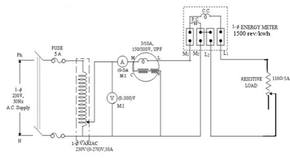

<head>

</head>

### Introduction

 The Energy Meter is a continuously operating measuring device that displays and records the electric energy consumed over a period by multiplying the measured instantaneous voltage and current. Induction type of energy meters is universally used for the measurement of energy in domestic and industrial a.c. circuits. Induction type of meters possess lower friction and higher torque/weight ratio. Also they are inexpensive and accurate, and retain their accuracy over a wide range of loads and temperature conditions. There are four main parts of the operating mechanism:    
(i) Driving system   
(ii) Moving system   
(iii) Braking system   
(iv) Registering system 

### Driving System: 

The driving system of the meter consists of two electromagnets. The core of these electromagnets is made up of silicon steel laminations. The coil of one of the electromagnets is excited by the load current. This coil is called the ‘current coil’. The coil of second electromagnet is connected across the supply and, therefore, carries a current proportional to the supply voltage. This coil is called the ‘pressure coil’. Consequently the two electromagnets are known as series and shunt magnets respectively. Copper shading bands are provided on the central limb. The position of these bands is adjustable. The function of these bands is to bring the flux produced by the shunt magnet exactly in quadrature with the applied voltage. 

### Moving System: 

This consists of an aluminium disc mounted on a light alloy shaft. This disc is positioned in the air gap between series and shunt magnets.
 

### Braking System:

A permanent magnet positioned near the edge of the aluminium disc forms the braking system. The aluminium disc moves in the field of this magnet and thus provides a braking torque. The position of the permanent magnet is adjustable, and therefore, braking torque can be adjusted by shifting the permanent magnet to different radial positions. 

### Registering (Counting) Mechanism: 
The function of a registering or counting mechanism is to record continuously a number which is proportional to the revolutions made by the moving system. 

 

**Fig. 1 Calibration and Testing of Single Phase Energy Meter**

In all induction instruments we have two fluxes produced by currents flowing in the windings of the instrument. These fluxes are alternating in nature and so they produce emfs in a metallic disc or a drum provided for the purpose. These emfs in turn circulate eddy currents in the metallic disc or the drum. The breaking torque is produced by the interaction of eddy current and the field of permanent magnet. This torque is directly proportional to the product of flux of the magnet, the magnitude of eddy current and effective radius ‘R’ from axis of disc. The moving system attains a steady speed when the driving torque equals the braking torque.   
  
The term testing includes the checking of the actual registration of the meter as well as the adjustments done to bring the errors of the meter within prescribed limits. AC energy meters should be tested for the following conditions:
1. At 5% of marked current with unity pf.
2. At 100% or 125% of marked current.
3. At one intermediate load with unity pf.
4. At marked current and 0.5 lagging pf. 

### Advantages of Energy Meter:

1. It calculates the electricity consumption quickly.
2. It provides real-time data. 
3. It minimises blackout and electric failures.
4. It reduces distribution losses.
5. The electricity meter is energy efficient. 

### Disadvantages of Energy Meter:

1. The electricity meter can abruptly stop showing readings.
2. If there are power fluctuations, it might show error.

